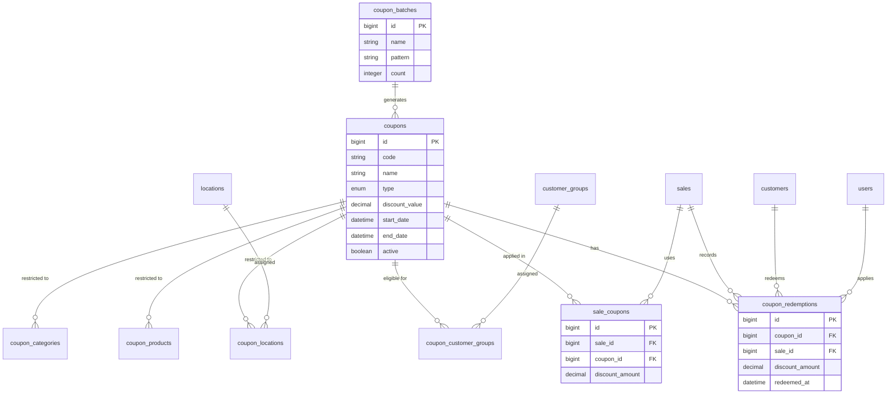

# Enterprise Coupon/Voucher Management System - Design Document

## Overview

This document outlines the comprehensive design for a coupon/voucher management system for the Rash Nail Lounge POS application. The system integrates with existing POS functionality to provide enterprise-level coupon management with advanced rules, bulk generation, real-time validation, and detailed analytics.

## 1. Database Schema

### 1.1 Core Tables

#### `coupons`

| Column | Type | Constraints | Description |
|--------|------|-------------|-------------|
| id | bigIncrements | primary key | Auto-increment ID |
| code | string(50) | unique, index | Coupon code (case-insensitive) |
| name | string(255) | not null | Display name |
| description | text | nullable | Detailed description |
| type | enum | not null | `percentage`, `fixed`, `bogo`, `free_shipping`, `tiered` |
| discount_value | decimal(10,2) | nullable | For fixed amount or percentage (e.g., 10.00 for 10%) |
| max_discount_amount | decimal(10,2) | nullable | Maximum discount for percentage coupons |
| minimum_purchase_amount | decimal(10,2) | default 0 | Minimum purchase required |
| start_date | datetime | not null | Coupon validity start |
| end_date | datetime | nullable | Coupon validity end |
| timezone | string(50) | default 'UTC' | Timezone for date comparisons |
| total_usage_limit | integer | nullable | Maximum total redemptions |
| per_customer_limit | integer | default 1 | Maximum redemptions per customer |
| stackable | boolean | default false | Can be combined with other coupons |
| active | boolean | default true | Whether coupon is enabled |
| location_restriction_type | enum | default 'all' | `all`, `specific` |
| customer_eligibility_type | enum | default 'all' | `all`, `new`, `existing`, `groups` |
| product_restriction_type | enum | default 'all' | `all`, `specific`, `categories` |
| metadata | json | nullable | Extra configuration (tiered thresholds, BOGO details, etc.) |
| batch_id | foreignId | nullable | Reference to batch if bulk-generated |
| created_at | timestamp | | |
| updated_at | timestamp | | |
| deleted_at | timestamp | nullable | Soft deletes |

**Indexes:**
- `code` (unique)
- `active`, `start_date`, `end_date` (for quick validity checks)
- `type`, `active`
- `batch_id`

#### `coupon_batches`

| Column | Type | Constraints | Description |
|--------|------|-------------|-------------|
| id | bigIncrements | primary key | |
| name | string(255) | not null | Batch name |
| description | text | nullable | |
| pattern | string(100) | not null | Pattern template e.g., "SUMMER-{RANDOM6}" |
| count | integer | not null | Number of coupons to generate |
| generated_count | integer | default 0 | Already generated coupons |
| status | enum | default 'pending' | `pending`, `generating`, `completed`, `failed` |
| settings | json | nullable | Common coupon attributes (discount_value, type, etc.) |
| created_at | timestamp | | |
| updated_at | timestamp | | |

#### `customer_groups`

| Column | Type | Constraints | Description |
|--------|------|-------------|-------------|
| id | bigIncrements | primary key | |
| name | string(255) | not null | Group name |
| description | text | nullable | |
| criteria | json | nullable | Dynamic segmentation rules (e.g., `{"min_orders": 5}`) |
| is_active | boolean | default true | |
| created_at | timestamp | | |
| updated_at | timestamp | | |

#### `coupon_redemptions`

| Column | Type | Constraints | Description |
|--------|------|-------------|-------------|
| id | bigIncrements | primary key | |
| coupon_id | foreignId | not null | References coupons |
| sale_id | foreignId | not null | References sales |
| customer_id | foreignId | nullable | References customers (if known) |
| redeemed_by_user_id | foreignId | nullable | References users (staff who applied) |
| discount_amount | decimal(10,2) | not null | Actual discount applied |
| redeemed_at | datetime | not null | |
| ip_address | string(45) | nullable | |
| user_agent | text | nullable | |
| metadata | json | nullable | Additional context |

**Indexes:**
- `coupon_id`, `sale_id` (unique together? maybe allow multiple coupons per sale if stackable)
- `customer_id`
- `redeemed_at`

#### `sale_coupons`

This table supports multiple coupons per sale (stackable). If a sale uses multiple coupons, each coupon gets an entry.

| Column | Type | Constraints | Description |
|--------|------|-------------|-------------|
| id | bigIncrements | primary key | |
| sale_id | foreignId | not null | References sales |
| coupon_id | foreignId | not null | References coupons |
| coupon_redemption_id | foreignId | nullable | References coupon_redemptions (optional) |
| discount_amount | decimal(10,2) | not null | Discount contributed by this coupon |
| created_at | timestamp | | |

**Indexes:**
- `sale_id`, `coupon_id` (unique together)
- `coupon_redemption_id` (unique)

### 1.2 Relationship Tables

#### `coupon_customer_groups` (pivot)

| Column | Type | Constraints |
|--------|------|-------------|
| coupon_id | foreignId | not null |
| customer_group_id | foreignId | not null |
| primary key (coupon_id, customer_group_id) |

#### `coupon_locations` (pivot)

| Column | Type | Constraints |
|--------|------|-------------|
| coupon_id | foreignId | not null |
| location_id | foreignId | not null |
| primary key (coupon_id, location_id) |

#### `coupon_products` (polymorphic)

| Column | Type | Constraints |
|--------|------|-------------|
| coupon_id | foreignId | not null |
| product_id | bigInteger | not null |
| product_type | string(255) | not null |
| restriction_type | enum('included', 'excluded') | default 'included' |

**Indexes:**
- `coupon_id`, `product_id`, `product_type` (unique)
- `product_type`, `product_id` (for reverse lookup)

#### `coupon_categories`

| Column | Type | Constraints |
|--------|------|-------------|
| coupon_id | foreignId | not null |
| category_id | foreignId | not null |
| category_type | string(255) | default 'App\Models\ServicePackageCategory' |
| primary key (coupon_id, category_id, category_type) |

### 1.3 Modifications to Existing Tables

#### `sales`

Add columns to support coupon tracking:

- `coupon_discount_amount` (decimal 10,2) – total discount from coupons (derived from sale_coupons, cached for performance)
- `applied_coupon_ids` (json) – array of coupon IDs applied (optional, for quick reference)

Alternatively, we can keep existing `discount_amount` column and deprecate it in favor of `coupon_discount_amount`. The manual discount fields (`discount_amount`, `discount_type`) will be phased out.

### 1.4 Schema Diagram (Mermaid)



## 2. Models and Relationships

### 2.1 Coupon Model (`App\Models\Coupon`)

```php
namespace App\Models;

use Illuminate\Database\Eloquent\Model;
use Illuminate\Database\Eloquent\SoftDeletes;
use Illuminate\Database\Eloquent\Relations\BelongsTo;
use Illuminate\Database\Eloquent\Relations\BelongsToMany;
use Illuminate\Database\Eloquent\Relations\HasMany;
use Illuminate\Database\Eloquent\Relations\MorphToMany;

class Coupon extends Model
{
    use SoftDeletes;

    protected $fillable = [
        'code', 'name', 'description', 'type', 'discount_value', 'max_discount_amount',
        'minimum_purchase_amount', 'start_date', 'end_date', 'timezone',
        'total_usage_limit', 'per_customer_limit', 'stackable', 'active',
        'location_restriction_type', 'customer_eligibility_type', 'product_restriction_type',
        'metadata', 'batch_id'
    ];

    protected $casts = [
        'discount_value' => 'decimal:2',
        'max_discount_amount' => 'decimal:2',
        'minimum_purchase_amount' => 'decimal:2',
        'start_date' => 'datetime',
        'end_date' => 'datetime',
        'total_usage_limit' => 'integer',
        'per_customer_limit' => 'integer',
        'stackable' => 'boolean',
        'active' => 'boolean',
        'metadata' => 'array',
    ];

    public const TYPE_PERCENTAGE = 'percentage';
    public const TYPE_FIXED = 'fixed';
    public const TYPE_BOGO = 'bogo';
    public const TYPE_FREE_SHIPPING = 'free_shipping';
    public const TYPE_TIERED = 'tiered';

    // Relationships
    public function batch(): BelongsTo
    {
        return $this->belongsTo(CouponBatch::class);
    }

    public function redemptions(): HasMany
    {
        return $this->hasMany(CouponRedemption::class);
    }

    public function customerGroups(): BelongsToMany
    {
        return $this->belongsToMany(CustomerGroup::class, 'coupon_customer_groups');
    }

    public function locations(): BelongsToMany
    {
        return $this->belongsToMany(Location::class, 'coupon_locations');
    }

    public function products(): MorphToMany
    {
        return $this->morphToMany(/* polymorphic */);
    }

    public function categories(): MorphToMany
    {
        return $this->morphToMany(ServicePackageCategory::class, 'categorizable', 'coupon_categories');
    }

    public function saleCoupons(): HasMany
    {
        return $this->hasMany(SaleCoupon::class);
    }

    // Scopes
    public function scopeActive($query)
    {
        return $query->where('active', true)
            ->where('start_date', '<=', now())
            ->where(function ($q) {
                $q->whereNull('end_date')->orWhere('end_date', '>=', now());
            });
    }

    // Business logic methods
    public function isValidForCustomer(Customer $customer, Sale $sale = null): bool
    {
        // Implementation in service layer
    }

    public function calculateDiscountAmount(float $subtotal, array $items): float
    {
        // Implementation in service layer
    }
}
```

### 2.2 Other Models

- `CouponBatch`
- `CustomerGroup`
- `CouponRedemption`
- `SaleCoupon`

## 3. Service Layer Architecture

### 3.1 CouponService

Central service for coupon validation, discount calculation, and redemption.

**Responsibilities:**
- Validate coupon against rules (dates, limits, eligibility, restrictions)
- Calculate discount amount based on coupon type and sale context
- Apply coupon to a sale (create redemption records)
- Bulk coupon generation
- Reporting and analytics queries

**Methods:**

```php
class CouponService
{
    public function validate(Coupon $coupon, Sale $sale, Customer $customer = null): ValidationResult;

    public function calculateDiscount(Coupon $coupon, float $subtotal, array $items): float;

    public function applyCoupon(Sale $sale, string $code, Customer $customer = null): CouponRedemption;

    public function generateBulkCoupons(CouponBatch $batch): void;

    public function getRedemptionStats(Coupon $coupon): array;

    public function getCustomerEligibility(Customer $customer, array $coupons): array;
}
```

### 3.2 CouponRuleEngine

Separate engine for evaluating complex rules (product restrictions, customer eligibility, location checks).

### 3.3 Integration with POS

- Extend `PosController` to accept coupon codes during checkout.
- Add real-time validation endpoint (`POST /api/pos/validate-coupon`).
- Modify sale creation to apply coupons before calculating totals.

## 4. API Endpoints and Routes

### 4.1 Admin API (`/admin/coupons/*`)

| Method | Endpoint | Description |
|--------|----------|-------------|
| GET | `/admin/coupons` | List coupons with filters |
| POST | `/admin/coupons` | Create single coupon |
| GET | `/admin/coupons/{id}` | Get coupon details |
| PUT | `/admin/coupons/{id}` | Update coupon |
| DELETE | `/admin/coupons/{id}` | Soft delete coupon |
| POST | `/admin/coupons/bulk-generate` | Generate bulk coupons |
| GET | `/admin/coupons/batches` | List coupon batches |
| GET | `/admin/coupons/{id}/redemptions` | Get redemption history |
| GET | `/admin/coupons/analytics/summary` | Analytics dashboard |

### 4.2 POS API (`/api/pos/*`)

| Method | Endpoint | Description |
|--------|----------|-------------|
| POST | `/api/pos/validate-coupon` | Validate coupon for current sale |
| POST | `/api/pos/apply-coupon` | Apply coupon to pending sale |
| DELETE | `/api/pos/remove-coupon` | Remove coupon from pending sale |

### 4.3 Customer API (`/api/customer/*`)

| Method | Endpoint | Description |
|--------|----------|-------------|
| GET | `/api/customer/coupons/available` | List available coupons for customer |
| GET | `/api/customer/coupons/used` | List redeemed coupons |

## 5. Admin UI Interface Structure

### 5.1 Coupon Management Dashboard

**Layout:** Follows existing UBold admin template pattern (similar to Services/Products management).

**Sections:**

1. **Coupon List** (`/admin/coupons`)
   - DataTable with columns: Code, Name, Type, Discount, Usage, Status, Dates, Actions
   - Filters: Active/Inactive, Type, Date Range
   - Quick stats cards: Total coupons, Active, Expired, Redemption rate

2. **Create/Edit Coupon Form** (`/admin/coupons/create`, `/admin/coupons/{id}/edit`)
   - Tabbed interface:
     - Basic Info (code, name, description, type, discount values)
     - Rules & Restrictions (dates, usage limits, minimum purchase)
     - Eligibility (customer groups, new/existing, locations)
     - Product Restrictions (specific items, categories)
   - Live validation preview

3. **Bulk Coupon Generator** (`/admin/coupons/bulk`)
   - Pattern builder with preview
   - Settings inheritance from template coupon
   - Progress tracking for generation

4. **Coupon Batch Management** (`/admin/coupons/batches`)
   - List of batches with generation status
   - Download generated codes as CSV

5. **Redemption Analytics** (`/admin/coupons/analytics`)
   - Dashboard widgets: Redemptions over time, Revenue impact, Top coupons
   - Exportable reports

### 5.2 UI Components

- **Coupon Type Selector**: Radio buttons with icons for each coupon type
- **Rule Condition Builder**: Dynamic form for product/category restrictions
- **Date/Time Picker** with timezone selection
- **Usage Limit Inputs** with live counters
- **Customer Group Multi-select** with search

## 6. POS Integration Interface

### 6.1 POS Checkout Flow Enhancements

**Current Flow:**
1. Add items → Enter discount manually → Process payment

**Enhanced Flow:**
1. Add items → Click "Apply Coupon" button
2. Enter coupon code → Real-time validation feedback
3. Apply coupon → Display discount breakdown
4. Option to add multiple coupons if stackable
5. Process payment with total discount shown

### 6.2 UI Changes to POS Interface

**New Elements:**
- Coupon entry field with apply button
- Applied coupons list (code, discount amount, remove button)
- Discount summary section
- Validation error messages using SweetAlert

**Real-time Validation:**
- As user types, check coupon validity via AJAX
- Visual indicators (green check / red cross)

**Receipt Integration:**
- Include applied coupon codes and discount amounts on printed receipt
- QR code for coupon redemption tracking

## 7. Reporting & Analytics Components

### 7.1 Core Metrics

- **Redemption Rate**: (Redemptions / Total coupons) × 100
- **Revenue Impact**: Total discount amount, Net revenue after discounts
- **Customer Adoption**: Unique customers using coupons
- **Effectiveness**: Conversion rate of coupon offers

### 7.2 Reports

1. **Redemption Summary Report**
   - Date range filter
   - Group by coupon, customer, location
   - Export to CSV/PDF

2. **Expired/Unused Coupons Report**
   - List coupons that never got redeemed
   - Insights for future campaigns

3. **Customer Segmentation Report**
   - Which customer groups redeem most
   - Average discount per segment

4. **Product Performance with Coupons**
   - Which products are most frequently discounted
   - Impact on product sales volume

### 7.3 Dashboard Widgets

- **Today's Redemptions** (count & value)
- **Top 5 Coupons** by redemptions
- **Expiring Soon** (coupons ending in next 7 days)
- **Redemption Trend Chart** (last 30 days)

## 8. Implementation Plan

### Phase 1: Foundation (Week 1-2)
- Database migrations for core tables
- Coupon, CouponBatch, CouponRedemption models
- Basic CRUD API endpoints
- Admin UI list and create forms (basic fields only)

### Phase 2: Rules Engine (Week 3-4)
- Advanced validation logic
- Product/category restrictions
- Customer eligibility rules
- Location restrictions
- Enhanced admin UI for rule configuration

### Phase 3: POS Integration (Week 5-6)
- POS coupon validation endpoint
- UI integration in POS checkout
- Sale coupon tracking (sale_coupons table)
- Receipt updates
- Testing with real sales data

### Phase 4: Bulk Generation & Analytics (Week 7-8)
- Bulk coupon generation with patterns
- Batch management UI
- Reporting dashboard
- Export functionality
- Performance optimizations

### Phase 5: Advanced Features & Polish (Week 9-10)
- Stackable coupons
- Tiered discount logic
- Customer group management UI
- Integration with existing customer segmentation
- Comprehensive testing and bug fixes

### Dependencies
- Existing POS must be stable
- Customer and location data models
- Permission system (roles for coupon management)
- SweetAlert for notifications

### Testing Strategy
1. **Unit Tests**: Coupon validation, discount calculation
2. **Feature Tests**: Admin CRUD, bulk generation
3. **Integration Tests**: POS checkout with coupons
4. **Performance Tests**: Bulk generation of 10,000+ coupons
5. **User Acceptance Testing**: With salon staff

### Migration Strategy
1. Add new tables alongside existing discount system
2. Dual-track: accept both manual discounts and coupons during transition
3. Gradual migration of existing manual discounts to coupon system
4. Eventually deprecate manual discount fields (optional)

## 9. Security & Permissions

### Required Permissions
- `view coupons` - View coupon list and details
- `create coupons` - Create new coupons
- `edit coupons` - Modify existing coupons
- `delete coupons` - Soft delete coupons
- `manage coupon batches` - Bulk generation
- `view coupon analytics` - Access reports

### Integration with Existing Role System
- Administrator: All permissions
- Manager: View, create, edit coupons (no delete)
- Staff: View only (for POS application)

## 10. Error Handling & Validation

### Validation Rules
- Coupon code uniqueness (case-insensitive)
- Date consistency (start_date <= end_date)
- Discount values appropriate for type
- Usage limits logical (per_customer <= total_limit)

### Error Responses
- Consistent JSON error format for API
- User-friendly messages in UI
- SweetAlert notifications for success/error

---

## Next Steps

1. **Review this design** with stakeholders
2. **Prioritize features** for MVP vs. future releases
3. **Assign development tasks** based on implementation phases
4. **Create detailed technical specifications** for each component

This design provides a comprehensive foundation for an enterprise-grade coupon management system that integrates seamlessly with the existing POS while offering scalability for future enhancements.