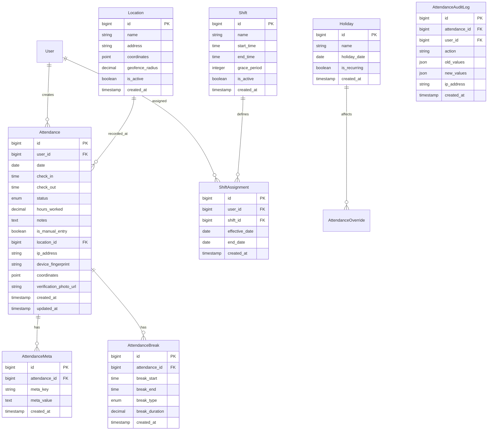

# Enterprise Attendance System - Comprehensive Analysis & Implementation Plan

## 1. Current System Analysis

### Existing Implementation
**Strengths:**
- Basic attendance tracking with check-in/check-out functionality
- Work schedule integration for late detection
- Manual entry capabilities for administrators
- Basic reporting and filtering
- Role-based access control (view/manage attendances)

**Current Database Schema:**
```sql
attendances:
- id, user_id, date, check_in (time), check_out (time)
- status (present, late, absent, leave, half_day)
- hours_worked (decimal), notes, is_manual_entry

work_schedules:
- user_id, day_of_week, start_time, end_time
- grace_period_minutes, is_working_day
```

**Current API Endpoints:**
- `POST /api/attendance/check-in` - Basic check-in
- `POST /api/attendance/check-out` - Basic check-out
- `GET /api/attendance/today-status` - Current user status
- Manual entry CRUD operations

### Gaps for Enterprise Requirements

**1. Limited Tracking Capabilities:**
- No geolocation validation
- No IP address tracking
- No device fingerprinting
- No photo capture for verification

**2. Missing Enterprise Features:**
- No shift management (multiple shifts per day)
- No break tracking (lunch, coffee breaks)
- No overtime calculation rules
- No holiday/leave type differentiation
- No multi-location support

**3. Inadequate Settings Integration:**
- No attendance-specific configuration
- No grace period settings per role/department
- No geofencing radius configuration
- No notification settings

**4. Limited Security & Compliance:**
- No audit logging for attendance changes
- No data integrity verification
- No tamper-proof records
- No compliance reporting

**5. Basic UI/UX:**
- No real-time status updates
- No mobile-optimized clock-in interface
- No dashboard widgets
- No push notifications

## 2. Enterprise Database Schema Enhancements

### New Tables Required:



### Enhanced Attendance Table Columns:
```sql
ALTER TABLE attendances ADD COLUMN (
    location_id BIGINT NULL REFERENCES locations(id),
    ip_address VARCHAR(45) NULL,
    device_fingerprint VARCHAR(255) NULL,
    coordinates POINT NULL,
    verification_photo_url VARCHAR(500) NULL,
    check_in_method ENUM('web', 'mobile', 'biometric', 'card') DEFAULT 'web',
    check_out_method ENUM('web', 'mobile', 'biometric', 'card') DEFAULT 'web',
    overtime_minutes INTEGER DEFAULT 0,
    early_departure_minutes INTEGER DEFAULT 0,
    late_arrival_minutes INTEGER DEFAULT 0,
    total_break_minutes INTEGER DEFAULT 0,
    is_approved BOOLEAN DEFAULT true,
    approved_by BIGINT NULL REFERENCES users(id),
    approved_at TIMESTAMP NULL
);
```

## 3. Settings Architecture for Attendance Configuration

### Settings Groups Structure:
```
attendance.general.*
attendance.shifts.*
attendance.locations.*
attendance.notifications.*
attendance.compliance.*
attendance.integrations.*
```

### Key Configuration Settings:

**General Settings:**
- `attendance.general.enable_geolocation` (boolean)
- `attendance.general.geofence_radius` (integer, meters)
- `attendance.general.require_photo_verification` (boolean)
- `attendance.general.auto_approval_threshold` (integer, minutes)
- `attendance.general.default_shift_id` (integer)

**Shift Management Settings:**
- `attendance.shifts.default_start_time` (time)
- `attendance.shifts.default_end_time` (time)
- `attendance.shifts.default_grace_period` (integer)
- `attendance.shifts.break_duration` (integer)
- `attendance.shifts.overtime_threshold` (integer)

**Location Settings:**
- `attendance.locations.enable_geofencing` (boolean)
- `attendance.locations.max_distance` (integer)
- `attendance.locations.require_location` (boolean)

**Notification Settings:**
- `attendance.notifications.late_checkin_enabled` (boolean)
- `attendance.notifications.missed_checkin_enabled` (boolean)
- `attendance.notifications.overtime_alert_enabled` (boolean)
- `attendance.notifications.daily_summary_enabled` (boolean)

**Compliance Settings:**
- `attendance.compliance.audit_log_retention` (integer, days)
- `attendance.compliance.require_manager_approval` (boolean)
- `attendance.compliance.max_manual_entries_per_month` (integer)

## 4. API Design for Enterprise Clock-in/Clock-out

### Enhanced API Endpoints:

**1. Check-in with Enterprise Features:**
```http
POST /api/v1/attendance/check-in
Content-Type: application/json
Authorization: Bearer {token}

{
  "notes": "Optional notes",
  "location": {
    "latitude": 6.9271,
    "longitude": 79.8612
  },
  "photo_verification": "base64_encoded_image",
  "device_info": {
    "user_agent": "Mozilla/5.0...",
    "device_id": "unique_device_fingerprint",
    "platform": "web/mobile"
  },
  "check_in_method": "mobile"
}
```

**Response:**
```json
{
  "success": true,
  "data": {
    "attendance_id": 123,
    "check_in_time": "2025-12-23 09:05:00",
    "status": "late",
    "message": "Checked in successfully. You are 5 minutes late.",
    "next_break_time": "12:00:00",
    "scheduled_check_out": "17:00:00"
  }
}
```

**2. Check-out with Break Calculation:**
```http
POST /api/v1/attendance/check-out
Content-Type: application/json

{
  "notes": "End of day",
  "location": {...},
  "breaks": [
    {
      "break_type": "lunch",
      "start_time": "12:00:00",
      "end_time": "13:00:00"
    }
  ]
}
```

**3. Real-time Status API:**
```http
GET /api/v1/attendance/current-status
GET /api/v1/attendance/today-details
GET /api/v1/attendance/monthly-summary?month=12&year=2025
```

**4. Break Management APIs:**
```http
POST /api/v1/attendance/break/start
POST /api/v1/attendance/break/end
GET /api/v1/attendance/break/history?date=2025-12-23
```

**5. Approval Workflow APIs:**
```http
POST /api/v1/attendance/{id}/approve
POST /api/v1/attendance/{id}/reject
GET /api/v1/attendance/pending-approvals
```

## 5. UI/UX Recommendations

### Dashboard Components:
1. **Real-time Attendance Dashboard**
   - Live counter of checked-in staff
   - Map view with staff locations (if enabled)
   - Today's attendance statistics
   - Late arrivals/early departures alerts

2. **Mobile-Optimized Clock-in Interface**
   - Large, accessible buttons for check-in/check-out
   - Location capture with map preview
   - Photo capture for verification
   - Offline capability with sync

3. **Staff Self-Service Portal**
   - Daily attendance summary
   - Break management interface
   - Overtime tracking
   - Leave balance display

4. **Manager Approval Interface**
   - Bulk approval/rejection
   - Exception reporting
   - Team attendance overview
   - Export capabilities

5. **Advanced Reporting Interface**
   - Custom date range filters
   - Department/team filters
   - Export to PDF/Excel/CSV
   - Visual charts and graphs

### Key UI Features:
- Push notifications for late check-ins
- Email/SMS alerts for critical events
- Dashboard widgets for quick insights
- Responsive design for all devices
- Dark/light mode support

## 6. Security & Compliance Requirements

### Security Measures:
1. **Data Encryption**
   - Encrypt sensitive location data
   - Secure photo storage
   - Encrypted device fingerprints

2. **Access Controls**
   - Role-based access (staff, manager, admin, HR)
   - Location-based restrictions
   - Time-based access controls

3. **Audit Trail**
   - Comprehensive logging of all changes
   - User action tracking
   - Data modification history

4. **Integrity Verification**
   - Hash-based record verification
   - Digital signatures for approvals
   - Tamper-evident logging

### Compliance Features:
1. **GDPR/Data Privacy**
   - Right to erasure implementation
   - Data export capabilities
   - Consent management

2. **Labor Law Compliance**
   - Break duration tracking
   - Overtime calculation
   - Maximum working hours enforcement

3. **Industry Standards**
   - ISO 27001 security controls
   - SOC 2 compliance features
   - Audit-ready reporting

## 7. Implementation Roadmap

### Phase 1: Foundation (Weeks 1-2)
1. Database schema enhancements
2. Settings architecture implementation
3. Enhanced Attendance model with new fields
4. Basic geolocation support

### Phase 2: Core Features (Weeks 3-4)
1. Enhanced check-in/check-out APIs
2. Break tracking functionality
3. Shift management system
4. Location/geofencing support

### Phase 3: Enterprise Features (Weeks 5-6)
1. Approval workflow system
2. Advanced reporting engine
3. Notification system
4. Audit logging implementation

### Phase 4: UI/UX Enhancement (Weeks 7-8)
1. Mobile-optimized interfaces
2. Real-time dashboard
3. Manager approval interface
4. Self-service portal

### Phase 5: Integration & Testing (Weeks 9-10)
1. Integration with existing systems
2. Comprehensive testing
3. Performance optimization
4. Security audit

### Phase 6: Deployment & Training (Weeks 11-12)
1. Staging deployment
2. User training materials
3. Production rollout
4. Post-deployment support

## 8. Integration Plan with Existing System

### Backward Compatibility:
1. Maintain existing API endpoints with deprecation notices
2. Migrate existing data to new schema
3. Update existing views to use enhanced models
4. Ensure role permissions are preserved

### Integration Points:
1. **User Management Integration**
   - Sync with existing user roles/permissions
   - Department/team structure integration

2. **Settings Integration**
   - Extend existing settings system
   - Add attendance-specific settings group

3. **Notification Integration**
   - Use existing notification channels
   - Extend with attendance-specific templates

4. **Reporting Integration**
   - Enhance existing reporting system
   - Add attendance reports to dashboard

### Migration Strategy:
1. Create migration scripts for new tables
2. Data migration with validation
3. Parallel run testing
4. Gradual feature rollout

## 9. Success Metrics

### Technical Metrics:
- API response time < 200ms
- 99.9% system availability
- Support for 1000+ concurrent users
- Mobile app load time < 3 seconds

### Business Metrics:
- Reduction in manual attendance processing by 80%
- 95% accuracy in attendance tracking
- 50% reduction in payroll errors
- 90% user adoption rate

### Compliance Metrics:
- 100% audit trail completeness
- Zero data integrity violations
- Full compliance with labor regulations
- 100% data privacy requirement fulfillment

---

## Next Steps

1. **Review this plan** and provide feedback on priorities
2. **Confirm technical requirements** for geolocation, photo capture, etc.
3. **Identify integration points** with existing HR/payroll systems
4. **Define user roles and permissions** matrix
5. **Establish testing and validation criteria**

This enterprise attendance system will transform the basic attendance tracking into a comprehensive, secure, and scalable solution that meets enterprise requirements while integrating seamlessly with the existing Laravel application.