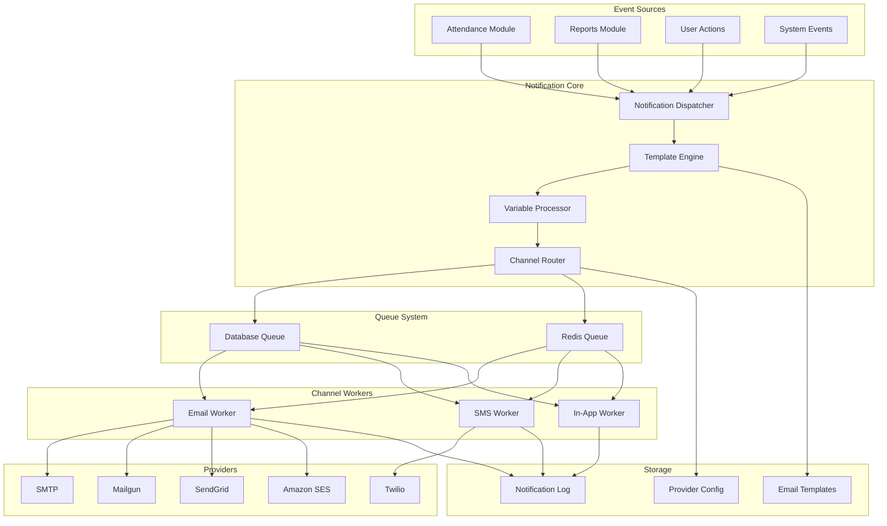
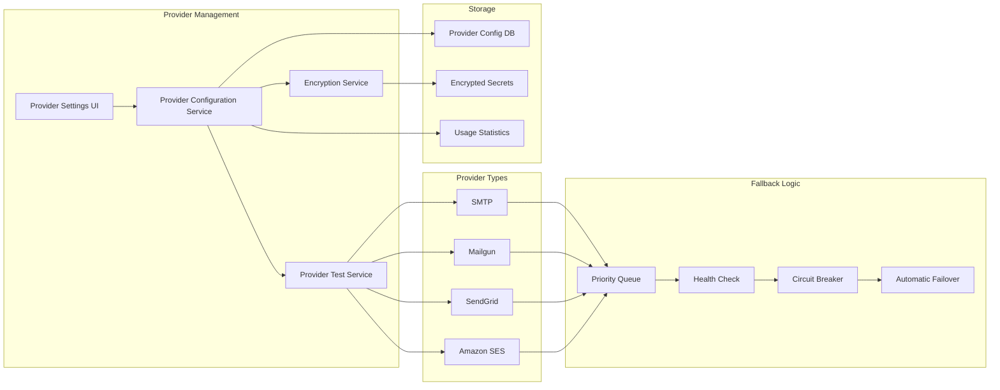
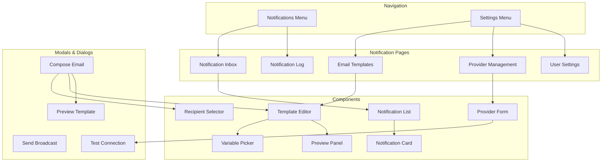
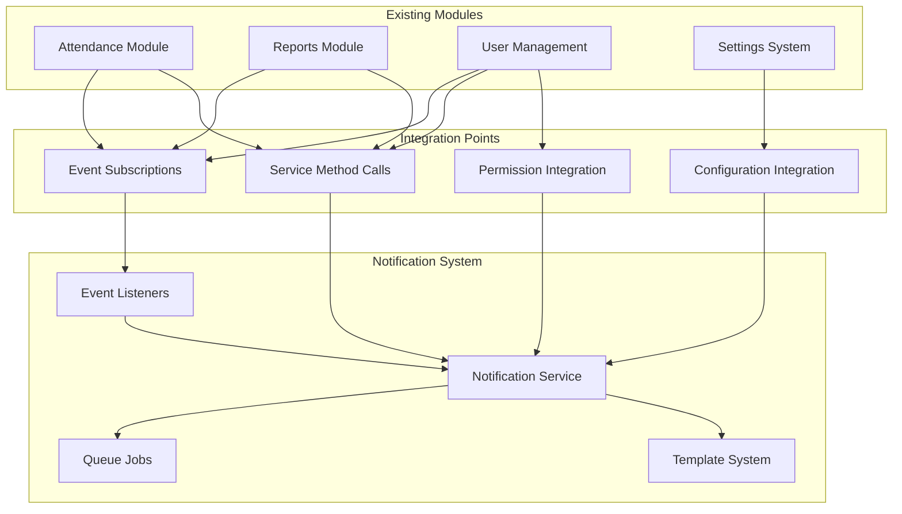

# Comprehensive Notification System Design

## 1. System Architecture Overview

### Event-Driven, Queued Architecture



### Key Components:

### Key Components:
1. **NotificationService**: Central orchestration service
2. **Channel Interfaces**: Email, SMS, In-App, Push (future)
3. **Template Engine**: Variable substitution, localization
4. **Provider Management**: Multiple email/SMS providers with fallback
5. **Notification Log**: Audit trail and status tracking

## 2. Database Schema Design

### Core Tables:

#### 2.1 notifications
```sql
CREATE TABLE notifications (
    id BIGINT UNSIGNED AUTO_INCREMENT PRIMARY KEY,
    uuid CHAR(36) NOT NULL UNIQUE,
    type VARCHAR(100) NOT NULL, -- e.g., 'attendance_check_in', 'report_generated'
    notifiable_type VARCHAR(255) NOT NULL,
    notifiable_id BIGINT UNSIGNED NOT NULL,
    data JSON NOT NULL, -- Notification payload
    read_at TIMESTAMP NULL,
    created_at TIMESTAMP NULL,
    updated_at TIMESTAMP NULL,
    INDEX idx_notifiable (notifiable_type, notifiable_id),
    INDEX idx_read (read_at),
    INDEX idx_type_created (type, created_at)
);
```

#### 2.2 notification_logs (Extended logging)
```sql
CREATE TABLE notification_logs (
    id BIGINT UNSIGNED AUTO_INCREMENT PRIMARY KEY,
    notification_id BIGINT UNSIGNED NULL,
    channel VARCHAR(50) NOT NULL, -- 'email', 'sms', 'in_app'
    provider VARCHAR(50) NOT NULL, -- 'smtp', 'mailgun', 'sendgrid', 'ses', 'twilio'
    recipient VARCHAR(255) NOT NULL, -- email, phone, user_id
    subject VARCHAR(255) NULL,
    content TEXT NULL,
    status VARCHAR(20) NOT NULL, -- 'pending', 'processing', 'sent', 'failed', 'delivered'
    error_message TEXT NULL,
    sent_at TIMESTAMP NULL,
    delivered_at TIMESTAMP NULL,
    retry_count INT DEFAULT 0,
    max_retries INT DEFAULT 3,
    metadata JSON NULL,
    created_at TIMESTAMP NULL,
    updated_at TIMESTAMP NULL,
    FOREIGN KEY (notification_id) REFERENCES notifications(id) ON DELETE SET NULL,
    INDEX idx_channel_status (channel, status),
    INDEX idx_recipient (recipient),
    INDEX idx_created (created_at)
);
```

#### 2.3 email_templates
```sql
CREATE TABLE email_templates (
    id BIGINT UNSIGNED AUTO_INCREMENT PRIMARY KEY,
    uuid CHAR(36) NOT NULL UNIQUE,
    name VARCHAR(255) NOT NULL,
    slug VARCHAR(255) NOT NULL UNIQUE,
    subject VARCHAR(255) NOT NULL,
    body_html TEXT NOT NULL,
    body_text TEXT NULL,
    variables JSON NOT NULL, -- Available variables: ['user_name', 'attendance_date', etc.]
    category VARCHAR(100) NOT NULL DEFAULT 'system', -- 'system', 'marketing', 'transactional'
    locale VARCHAR(10) NOT NULL DEFAULT 'en',
    is_active BOOLEAN DEFAULT TRUE,
    created_by BIGINT UNSIGNED NULL,
    updated_by BIGINT UNSIGNED NULL,
    created_at TIMESTAMP NULL,
    updated_at TIMESTAMP NULL,
    INDEX idx_slug (slug),
    INDEX idx_category_locale (category, locale),
    INDEX idx_is_active (is_active)
);
```

#### 2.4 notification_providers
```sql
CREATE TABLE notification_providers (
    id BIGINT UNSIGNED AUTO_INCREMENT PRIMARY KEY,
    channel VARCHAR(50) NOT NULL, -- 'email', 'sms'
    provider VARCHAR(50) NOT NULL, -- 'smtp', 'mailgun', 'sendgrid', 'ses', 'twilio', 'vonage'
    name VARCHAR(255) NOT NULL,
    is_default BOOLEAN DEFAULT FALSE,
    priority INT DEFAULT 0, -- Lower number = higher priority
    config JSON NOT NULL, -- Encrypted provider configuration
    is_active BOOLEAN DEFAULT TRUE,
    last_test_at TIMESTAMP NULL,
    last_test_status VARCHAR(20) NULL,
    daily_limit INT NULL,
    monthly_limit INT NULL,
    usage_count INT DEFAULT 0,
    created_at TIMESTAMP NULL,
    updated_at TIMESTAMP NULL,
    UNIQUE KEY uk_channel_provider (channel, provider),
    INDEX idx_channel_active (channel, is_active),
    INDEX idx_priority (priority)
);
```

#### 2.5 provider_configurations (Secure storage)
```sql
CREATE TABLE provider_configurations (
    id BIGINT UNSIGNED AUTO_INCREMENT PRIMARY KEY,
    provider_id BIGINT UNSIGNED NOT NULL,
    key VARCHAR(100) NOT NULL, -- 'api_key', 'secret', 'host', 'port', etc.
    value_encrypted TEXT NOT NULL, -- Encrypted value
    is_secret BOOLEAN DEFAULT TRUE,
    created_at TIMESTAMP NULL,
    updated_at TIMESTAMP NULL,
    FOREIGN KEY (provider_id) REFERENCES notification_providers(id) ON DELETE CASCADE,
    INDEX idx_provider_key (provider_id, key)
);
```

#### 2.6 notification_settings (User/System preferences)
```sql
CREATE TABLE notification_settings (
    id BIGINT UNSIGNED AUTO_INCREMENT PRIMARY KEY,
    user_id BIGINT UNSIGNED NULL, -- NULL = system default
    notification_type VARCHAR(100) NOT NULL,
    channel VARCHAR(50) NOT NULL, -- 'email', 'sms', 'in_app', 'push'
    is_enabled BOOLEAN DEFAULT TRUE,
    preferences JSON NULL, -- Channel-specific preferences
    created_at TIMESTAMP NULL,
    updated_at TIMESTAMP NULL,
    FOREIGN KEY (user_id) REFERENCES users(id) ON DELETE CASCADE,
    UNIQUE KEY uk_user_type_channel (user_id, notification_type, channel),
    INDEX idx_type_channel (notification_type, channel)
);
```

## 3. Service Layer Design

### 3.1 NotificationService (Core Orchestrator)
```php
namespace App\Services\Notification;

class NotificationService
{
    public function send(Notification $notification, array $channels = null): void
    public function queue(Notification $notification, array $channels = null): void
    public function sendToUser(User $user, string $type, array $data, array $channels = null): void
    public function sendToUsers(Collection $users, string $type, array $data, array $channels = null): void
    public function sendBroadcast(string $type, array $data, array $channels = null): void
    public function getStatus(string $notificationId): array
    public function retryFailed(string $notificationId): bool
}
```

### 3.2 Channel Interfaces
```php
namespace App\Services\Notification\Channels;

interface NotificationChannel
{
    public function send(Notifiable $notifiable, Notification $notification): bool;
    public function canSend(Notifiable $notifiable, Notification $notification): bool;
    public function getStatus(): array;
}

class EmailChannel implements NotificationChannel
class SMSChannel implements NotificationChannel  
class InAppChannel implements NotificationChannel
```

### 3.3 EmailNotificationService
```php
namespace App\Services\Notification;

class EmailNotificationService
{
    public function sendSystemEmail(string $templateSlug, array $recipients, array $variables): void
    public function sendUserEmail(User $user, string $templateSlug, array $variables = []): void
    public function sendBroadcastEmail(array $recipients, string $subject, string $body, array $attachments = []): void
    public function queueEmail(string $templateSlug, array $recipients, array $variables, Carbon $sendAt = null): void
    public function testConnection(string $provider = null): bool
}
```

### 3.4 TemplateService
```php
namespace App\Services\Notification;

class TemplateService
{
    public function render(string $slug, array $variables, string $locale = null): RenderedTemplate
    public function create(array $data): EmailTemplate
    public function update(string $slug, array $data): EmailTemplate
    public function getVariables(string $slug): array
    public function validateVariables(array $templateVariables, array $providedVariables): bool
}
```

## 4. Channel Design

### 4.1 Email Channel
- Supports multiple providers: SMTP, Mailgun, SendGrid, Amazon SES
- Fallback mechanism with configurable retry logic
- Template-based rendering with variable substitution
- Attachment support
- HTML and plain text versions

### 4.2 SMS Channel (Future)
- Provider abstraction (Twilio, Vonage, etc.)
- Template support with character limits
- Delivery status tracking
- Rate limiting

### 4.3 In-App Channel
- Database storage with user-specific notifications
- Mark as read/unread functionality
- Real-time updates via polling (WebSocket optional)
- Notification preferences per user

## 5. Templating System Design

### 5.1 Template Structure
```json
{
  "name": "Attendance Check-In Notification",
  "slug": "attendance_check_in",
  "subject": "{{user_name}} has checked in at {{check_in_time}}",
  "body_html": "<p>Hello {{manager_name}},</p><p>{{user_name}} has checked in at {{check_in_time}}</p>",
  "variables": [
    {"name": "user_name", "type": "string", "required": true},
    {"name": "check_in_time", "type": "datetime", "required": true},
    {"name": "manager_name", "type": "string", "required": false}
  ],
  "locales": {
    "en": {"subject": "...", "body_html": "..."},
    "es": {"subject": "...", "body_html": "..."}
  }
}
```

### 5.2 Variable Substitution Engine
- Handles different data types (string, datetime, number)
- Formatting options (date_format, number_format)
- Conditional rendering
- Loop support for arrays

### 5.3 Localization Support
- Multi-language template storage
- Fallback to default locale
- Locale-specific variable formatting

## 6. SMTP & Provider Management System Design

### 6.1 Provider Configuration Architecture



### 6.2 Provider Configuration Structure

#### SMTP Provider:
```json
{
  "provider": "smtp",
  "config": {
    "host": "smtp.gmail.com",
    "port": 587,
    "encryption": "tls",
    "username": "user@example.com",
    "password": "encrypted_password",
    "timeout": 30,
    "auth_mode": "login"
  }
}
```

#### Mailgun Provider:
```json
{
  "provider": "mailgun",
  "config": {
    "domain": "mg.example.com",
    "secret": "encrypted_api_key",
    "endpoint": "api.mailgun.net",
    "scheme": "https"
  }
}
```

#### SendGrid Provider:
```json
{
  "provider": "sendgrid",
  "config": {
    "api_key": "encrypted_api_key",
    "version": "v3"
  }
}
```

#### Amazon SES Provider:
```json
{
  "provider": "ses",
  "config": {
    "key": "encrypted_access_key",
    "secret": "encrypted_secret_key",
    "region": "us-east-1",
    "version": "latest"
  }
}
```

### 6.3 Fallback Mechanism

```php
class ProviderFallbackManager
{
    private array $providers;
    private array $failedProviders = [];
    
    public function send(Email $email): bool
    {
        foreach ($this->getActiveProviders() as $provider) {
            if ($this->isProviderHealthy($provider)) {
                try {
                    $result = $provider->send($email);
                    if ($result) {
                        $this->recordSuccess($provider);
                        return true;
                    }
                } catch (Exception $e) {
                    $this->recordFailure($provider, $e);
                    continue;
                }
            }
        }
        
        $this->queueForRetry($email);
        return false;
    }
    
    private function getActiveProviders(): array
    {
        return array_filter($this->providers, function($provider) {
            return $provider->isActive() &&
                   !in_array($provider->getId(), $this->failedProviders) &&
                   !$this->isCircuitBreakerOpen($provider);
        });
    }
}
```

### 6.4 Health Monitoring & Circuit Breaker

```php
class CircuitBreaker
{
    private const FAILURE_THRESHOLD = 5;
    private const RESET_TIMEOUT = 300; // 5 minutes
    
    private array $failureCount = [];
    private array $lastFailureTime = [];
    
    public function isOpen(string $providerId): bool
    {
        if (!isset($this->failureCount[$providerId])) {
            return false;
        }
        
        if ($this->failureCount[$providerId] < self::FAILURE_THRESHOLD) {
            return false;
        }
        
        // Check if reset timeout has passed
        if (isset($this->lastFailureTime[$providerId])) {
            $timeSinceLastFailure = time() - $this->lastFailureTime[$providerId];
            if ($timeSinceLastFailure > self::RESET_TIMEOUT) {
                $this->reset($providerId);
                return false;
            }
        }
        
        return true;
    }
    
    public function recordFailure(string $providerId): void
    {
        $this->failureCount[$providerId] = ($this->failureCount[$providerId] ?? 0) + 1;
        $this->lastFailureTime[$providerId] = time();
    }
    
    public function recordSuccess(string $providerId): void
    {
        $this->reset($providerId);
    }
}
```

### 6.5 Test Email Feature

```php
class ProviderTestService
{
    public function testConnection(string $providerId): TestResult
    {
        $provider = $this->providerRepository->find($providerId);
        
        try {
            // Test connection
            $connection = $this->createConnection($provider);
            $connection->test();
            
            // Send test email
            $testEmail = new TestEmail(
                to: $provider->getTestRecipient(),
                subject: 'Test Email from Notification System',
                body: 'This is a test email to verify provider configuration.'
            );
            
            $result = $connection->send($testEmail);
            
            return new TestResult(
                success: true,
                message: 'Connection test successful',
                details: [
                    'provider' => $provider->getName(),
                    'response_time' => $connection->getResponseTime(),
                    'test_email_sent' => $result
                ]
            );
            
        } catch (Exception $e) {
            return new TestResult(
                success: false,
                message: 'Connection test failed: ' . $e->getMessage(),
                error: $e->getMessage(),
                details: [
                    'provider' => $provider->getName(),
                    'error_type' => get_class($e)
                ]
            );
        }
    }
}
```

## 7. Security Design

### 7.1 Encrypted Credential Storage
- Use Laravel's built-in encryption with application key
- Separate `provider_configurations` table for sensitive data
- Key rotation support via Laravel's key:rotate command
- Audit logging for credential access and modifications
- Environment-based encryption for different deployment stages

### 7.2 Permission Model
```php
// Using Spatie Permissions
$permissions = [
    'view_notifications',
    'create_notifications',
    'edit_notifications',
    'delete_notifications',
    'send_notifications',
    'manage_email_templates',
    'configure_email_providers',
    'view_notification_logs',
    'send_broadcast_emails',
    'test_email_providers',
    'view_provider_usage'
];

$roles = [
    'admin' => ['all permissions'],
    'manager' => [
        'view_notifications',
        'send_notifications',
        'manage_email_templates',
        'send_broadcast_emails',
        'test_email_providers',
        'view_notification_logs',
        'view_provider_usage'
    ],
    'user' => ['view_notifications']
];
```

### 7.3 Rate Limiting & Quotas
- Per-provider daily/monthly limits (configurable)
- User-level notification limits to prevent abuse
- Queue-based throttling for bulk operations
- Circuit breaker pattern for failing providers
- Graceful degradation when limits reached

## 8. UI/UX Design

### 8.1 Component Structure



### 8.2 Notification Inbox Design
- **Layout**: Sidebar with notification categories, main content area
- **Features**:
  - Unread count badge
  - Mark all as read
  - Filter by type (system, attendance, reports)
  - Search within notifications
  - Pagination for large lists
- **Notification Card**:
  - Icon indicating notification type
  - Title with bold for unread
  - Preview text (truncated)
  - Timestamp (relative time)
  - Action buttons (mark read, delete, view details)

### 8.3 Email Provider Management Interface
- **Provider List View**:
  - Table with columns: Name, Type, Status, Priority, Usage, Actions
  - Status indicators (active, testing, failed)
  - Quick actions: Test, Edit, Toggle Active
- **Provider Form**:
  - Dynamic form fields based on provider type
  - Tabbed interface: Basic Settings, Advanced, Test
  - Real-time validation
  - Test connection button with live feedback
  - Encrypted field masking (show/hide toggle)
- **Priority Management**:
  - Drag-and-drop reordering
  - Visual priority indicators
  - Automatic fallback configuration

### 8.4 Template Management Interface
- **Template List**:
  - Grid/card view with template preview
  - Filter by category, locale, status
  - Quick actions: Edit, Duplicate, Preview, Toggle Active
- **Template Editor**:
  - Split view: Code editor on left, Live preview on right
  - WYSIWYG toolbar with formatting options
  - Variable picker sidebar with available variables
  - Locale selector for multi-language templates
  - Version history with diff view
  - Save as draft/publish workflow
- **Preview Mode**:
  - Test with sample data
  - Toggle between HTML/text views
  - Send test email functionality

### 8.5 Notification Log & Analytics
- **Dashboard View**:
  - Key metrics: Total sent, Success rate, Average delivery time
  - Charts: Daily volume, Channel distribution, Failure reasons
  - Top recipients, Most active templates
- **Log Table**:
  - Advanced filtering: date range, status, channel, provider, recipient
  - Bulk actions: Retry failed, Export, Delete
  - Detailed view: Full payload, error stack trace, retry history
  - Linked to original notification/event
- **Export Features**:
  - CSV/Excel export with customizable columns
  - Scheduled reports
  - API access for integration

### 8.6 Email Composition Interface
- **Recipient Selection**:
  - Typeahead search for users
  - Role-based selection (e.g., all managers, all staff)
  - Group management (create, save, reuse groups)
  - Import from CSV
- **Template Integration**:
  - Template selector with preview
  - Variable auto-population based on recipient
  - Merge tag support for personalization
- **Content Editor**:
  - Rich text editor with formatting
  - Image upload and management
  - Attachment support
  - Mobile preview
- **Scheduling & Delivery**:
  - Send now or schedule for later
  - Timezone-aware scheduling
  - Delivery optimization (batch, throttle)
  - Cancel/unsend capability (within limits)

### 8.7 User Notification Settings
- **Channel Preferences**:
  - Per-channel toggles (Email, SMS, In-App)
  - Quiet hours configuration (start/end time, days)
  - Do-not-disturb mode
- **Notification Type Management**:
  - Matrix view: Notification types × Channels
  - Bulk enable/disable by category
  - Custom rules (e.g., "only email for high priority")
- **Digest Preferences**:
  - Daily/weekly digest options
  - Digest content selection
  - Preferred delivery time

### 8.8 Responsive Design Considerations
- **Mobile First**: All interfaces optimized for mobile
- **Progressive Enhancement**: Core functionality works without JavaScript
- **Accessibility**: WCAG 2.1 AA compliance
- **Performance**: Lazy loading for large lists, optimistic updates
- **Consistency**: Follow existing application design patterns

### 8.9 Integration with Existing UI Components
- Use existing Bootstrap 5 components from the codebase
- Consistent color scheme with application theme
- Reuse existing modal, table, and form components
- Follow established navigation patterns
- Integrate with existing permission system UI

## 9. Integration Design

### 9.1 Integration Architecture



### 9.2 Attendance Module Integration

#### 9.2.1 Event-Based Integration
```php
// Create new events in Attendance module
class AttendanceCheckedIn
{
    public function __construct(
        public Attendance $attendance,
        public User $user
    ) {}
}

class AttendanceCheckedOut
{
    public function __construct(
        public Attendance $attendance,
        public User $user
    ) {}
}

class LateCheckInDetected
{
    public function __construct(
        public Attendance $attendance
    ) {}
}

// Event listeners in Notification module
class SendAttendanceCheckInNotification
{
    public function handle(AttendanceCheckedIn $event): void
    {
        $notificationService = app(NotificationService::class);
        
        $variables = [
            'user_name' => $event->user->name,
            'check_in_time' => $event->attendance->check_in->format('Y-m-d H:i:s'),
            'attendance_date' => $event->attendance->date->format('Y-m-d'),
            'status' => $event->attendance->status,
            'location' => $event->attendance->location?->name,
            'late_minutes' => $event->attendance->late_minutes ?? 0
        ];
        
        // Send to manager
        if ($manager = $event->user->manager) {
            $variables['manager_name'] = $manager->name;
            $notificationService->sendToUser(
                $manager,
                'attendance_check_in',
                $variables,
                ['email', 'in_app']
            );
        }
        
        // Send to user if configured
        if (Setting::get('attendance.notifications.notify_user_on_check_in', false)) {
            $notificationService->sendToUser(
                $event->user,
                'attendance_check_in_user',
                $variables,
                ['email', 'in_app']
            );
        }
    }
}
```

#### 9.2.2 Direct Service Integration (Backward Compatibility)
```php
// Updated AttendanceService methods
private function sendCheckInNotifications(Attendance $attendance, User $user): void
{
    // Dispatch event for event-driven architecture
    event(new AttendanceCheckedIn($attendance, $user));
    
    // Also call directly for immediate processing if needed
    $notificationService = app(NotificationService::class);
    
    $variables = [
        'user_name' => $user->name,
        'check_in_time' => $attendance->check_in->format('Y-m-d H:i:s'),
        'attendance_date' => $attendance->date->format('Y-m-d'),
        'status' => $attendance->status,
        'location' => $attendance->location?->name
    ];
    
    // Send late check-in notification if applicable
    if ($attendance->status === 'late') {
        $notificationService->sendToUser(
            $user,
            'attendance_late_check_in',
            array_merge($variables, [
                'late_minutes' => $attendance->late_minutes,
                'scheduled_time' => $attendance->scheduled_start_time?->format('H:i:s')
            ]),
            ['email', 'in_app']
        );
    }
}
```

### 9.3 Reports Module Integration

#### 9.3.1 Report Generation Notifications
```php
class ReportGenerated
{
    public function __construct(
        public Report $report,
        public User $generatedBy,
        public string $downloadUrl
    ) {}
}

class SendReportNotification
{
    public function handle(ReportGenerated $event): void
    {
        $notificationService = app(NotificationService::class);
        
        $variables = [
            'report_name' => $event->report->name,
            'generated_by' => $event->generatedBy->name,
            'generated_at' => now()->format('Y-m-d H:i:s'),
            'report_type' => $event->report->type,
            'download_url' => $event->downloadUrl,
            'file_size' => $event->report->file_size_human,
            'row_count' => $event->report->row_count
        ];
        
        // Send to requester
        $notificationService->sendToUser(
            $event->generatedBy,
            'report_generated',
            $variables,
            ['email', 'in_app']
        );
        
        // Send to additional recipients if specified
        foreach ($event->report->additionalRecipients as $recipient) {
            $notificationService->sendToUser(
                $recipient,
                'report_generated_recipient',
                $variables,
                ['email']
            );
        }
    }
}
```

#### 9.3.2 Scheduled Report Delivery
```php
class ScheduledReportService
{
    public function deliverScheduledReport(ScheduledReport $schedule): void
    {
        $report = $this->generateReport($schedule);
        
        $emailService = app(EmailNotificationService::class);
        
        $emailService->sendBroadcastEmail(
            recipients: $schedule->recipients,
            subject: $schedule->email_subject,
            body: $this->renderReportEmail($report, $schedule),
            attachments: [
                [
                    'content' => $report->content,
                    'filename' => $report->filename,
                    'mime' => $report->mime_type
                ]
            ]
        );
        
        // Log delivery
        NotificationLog::create([
            'type' => 'scheduled_report',
            'recipients_count' => count($schedule->recipients),
            'report_id' => $report->id,
            'scheduled_report_id' => $schedule->id,
            'status' => 'sent'
        ]);
    }
}
```

### 9.4 User Management Integration

#### 9.4.1 User Lifecycle Notifications
```php
// User created notification
class SendWelcomeNotification
{
    public function handle(UserCreated $event): void
    {
        $notificationService = app(NotificationService::class);
        
        $variables = [
            'user_name' => $event->user->name,
            'user_email' => $event->user->email,
            'account_created_at' => now()->format('Y-m-d H:i:s'),
            'login_url' => url('/login'),
            'support_email' => config('mail.support_email')
        ];
        
        $notificationService->sendToUser(
            $event->user,
            'welcome_email',
            $variables,
            ['email']
        );
        
        // Notify admin about new user
        $admins = User::role('admin')->get();
        foreach ($admins as $admin) {
            $notificationService->sendToUser(
                $admin,
                'new_user_registered',
                array_merge($variables, [
                    'admin_name' => $admin->name,
                    'user_role' => $event->user->getRoleNames()->first()
                ]),
                ['email', 'in_app']
            );
        }
    }
}
```

#### 9.4.2 Password Reset & Security Notifications
- Password reset requests
- Password changed notifications
- Login from new device
- Account locked/unlocked
- Two-factor authentication changes

### 9.5 Settings System Integration

#### 9.5.1 Configuration Integration
```php
// Extend existing Settings system
class NotificationSettings extends SettingCategory
{
    protected string $key = 'notifications';
    
    protected array $defaults = [
        'email' => [
            'default_provider' => 'smtp',
            'from_address' => 'noreply@example.com',
            'from_name' => 'Notification System',
            'reply_to' => 'support@example.com'
        ],
        'attendance' => [
            'notify_manager_on_check_in' => true,
            'notify_manager_on_check_out' => true,
            'notify_on_late_check_in' => true,
            'notify_user_on_check_in' => false,
            'notify_user_on_check_out' => false
        ],
        'reports' => [
            'notify_on_completion' => true,
            'notify_on_failure' => true,
            'default_recipients' => []
        ]
    ];
    
    public function getValidationRules(): array
    {
        return [
            'email.default_provider' => 'required|in:smtp,mailgun,sendgrid,ses',
            'email.from_address' => 'required|email',
            'attendance.notify_manager_on_check_in' => 'boolean',
            // ... other rules
        ];
    }
}
```

#### 9.5.2 Permission Integration
```php
// Add notification permissions to Spatie Permission system
class NotificationPermissionSeeder extends Seeder
{
    public function run(): void
    {
        $permissions = [
            'view_notifications',
            'create_notifications',
            'edit_notifications',
            'delete_notifications',
            'send_notifications',
            'manage_email_templates',
            'configure_email_providers',
            'view_notification_logs',
            'send_broadcast_emails',
            'test_email_providers'
        ];
        
        foreach ($permissions as $permission) {
            Permission::firstOrCreate(['name' => $permission, 'guard_name' => 'web']);
        }
        
        // Assign to roles
        $adminRole = Role::firstOrCreate(['name' => 'admin']);
        $adminRole->givePermissionTo($permissions);
        
        $managerRole = Role::firstOrCreate(['name' => 'manager']);
        $managerRole->givePermissionTo([
            'view_notifications',
            'send_notifications',
            'manage_email_templates',
            'send_broadcast_emails',
            'view_notification_logs'
        ]);
    }
}
```

### 9.6 Queue System Integration

#### 9.6.1 Laravel Queue Configuration
```php
// Use existing queue configuration
'notifications' => [
    'driver' => 'database',
    'table' => 'jobs',
    'queue' => 'notifications',
    'retry_after' => 90,
    'after_commit' => false,
],

// Job classes
class ProcessNotificationJob implements ShouldQueue
{
    use Dispatchable, InteractsWithQueue, Queueable, SerializesModels;
    
    public function __construct(
        protected Notification $notification,
        protected array $channels
    ) {}
    
    public function handle(NotificationService $service): void
    {
        $service->process($this->notification, $this->channels);
    }
    
    public function failed(Throwable $exception): void
    {
        // Log failure
        NotificationLog::create([
            'notification_id' => $this->notification->id,
            'status' => 'failed',
            'error_message' => $exception->getMessage(),
            'error_trace' => $exception->getTraceAsString()
        ]);
    }
}
```

#### 9.6.2 Batch Processing for Broadcasts
```php
class SendBroadcastNotification implements ShouldQueue
{
    use Batchable, Dispatchable, InteractsWithQueue, Queueable, SerializesModels;
    
    public function __construct(
        protected string $templateSlug,
        protected array $recipientIds,
        protected array $variables
    ) {}
    
    public function handle(EmailNotificationService $service): void
    {
        $users = User::whereIn('id', $this->recipientIds)->get();
        
        foreach ($users as $user) {
            if ($this->batch()->cancelled()) {
                return;
            }
            
            $service->sendUserEmail($user, $this->templateSlug, $this->variables);
            
            $this->batch()->progress++;
        }
    }
}
```

### 9.7 Migration Path from Existing System

#### 9.7.1 Phase 1: Coexistence
- Keep existing notification classes
- Add new NotificationService as optional
- Create migration to copy existing templates to new system
- Run both systems in parallel

#### 9.7.2 Phase 2: Transition
- Update AttendanceService to use new system
- Create event listeners for backward compatibility
- Migrate notification settings
- Update UI to use new components

#### 9.7.3 Phase 3: Decommission
- Remove old notification classes
- Clean up unused database tables
- Update documentation
- Final testing and validation

### 9.8 Testing Integration Points

#### 9.8.1 Integration Test Suite
```php
class NotificationIntegrationTest extends TestCase
{
    public function test_attendance_check_in_notification(): void
    {
        // Setup
        $user = User::factory()->create();
        $manager = User::factory()->create()->assignRole('manager');
        $attendance = Attendance::factory()->create(['user_id' => $user->id]);
        
        // Mock notification service
        $mock = $this->mock(NotificationService::class);
        $mock->shouldReceive('sendToUser')
            ->twice()
            ->withArgs(function ($recipient, $type, $variables, $channels) use ($manager, $user) {
                return in_array($recipient->id, [$manager->id, $user->id]);
            });
        
        // Trigger check-in
        $service = new AttendanceService();
        $service->checkIn($user, []);
        
        // Assert events were dispatched
        Event::assertDispatched(AttendanceCheckedIn::class);
    }
    
    public function test_report_generation_notification(): void
    {
        // Test report notification flow
    }
    
    public function test_broadcast_email_permissions(): void
    {
        // Test permission-based access control
    }
}
```

## 9. API Endpoint Specifications

### 9.1 Notification Management API
```
GET    /api/notifications                    - List notifications
GET    /api/notifications/{id}              - Get notification details
POST   /api/notifications                   - Create notification
PUT    /api/notifications/{id}              - Update notification
DELETE /api/notifications/{id}              - Delete notification
POST   /api/notifications/{id}/retry        - Retry failed notification
GET    /api/notifications/{id}/status       - Get delivery status
```

### 9.2 Template Management API
```
GET    /api/notification-templates          - List templates
GET    /api/notification-templates/{slug}   - Get template
POST   /api/notification-templates          - Create template
PUT    /api/notification-templates/{slug}   - Update template
DELETE /api/notification-templates/{slug}   - Delete template
POST   /api/notification-templates/{slug}/preview - Preview template
GET    /api/notification-templates/{slug}/variables - Get available variables
```

### 9.3 Provider Management API
```
GET    /api/notification-providers          - List providers
GET    /api/notification-providers/{id}     - Get provider
POST   /api/notification-providers          - Create provider
PUT    /api/notification-providers/{id}     - Update provider
DELETE /api/notification-providers/{id}     - Delete provider
POST   /api/notification-providers/{id}/test - Test connection
GET    /api/notification-providers/{id}/usage - Get usage statistics
```

### 9.4 User Notification API
```
GET    /api/user/notifications              - Get user notifications
PUT    /api/user/notifications/{id}/read    - Mark as read
PUT    /api/user/notifications/{id}/unread  - Mark as unread
DELETE /api/user/notifications/{id}         - Delete notification
GET    /api/user/notification-settings      - Get settings
PUT    /api/user/notification-settings      - Update settings
```

## 10. Implementation Roadmap

### 10.1 Phase 1: Core Foundation (Weeks 1-2)
1. **Database Migration**
   - Create all notification-related tables
   - Add foreign key constraints
   - Set up indexes for performance

2. **Core Services**
   - Implement NotificationService with basic send/queue functionality
   - Create EmailChannel with SMTP provider support
   - Implement TemplateService with variable substitution
   - Set up encrypted credential storage

3. **Basic Integration**
   - Create event listeners for Attendance module
   - Update AttendanceService to use new notification system
   - Set up queue jobs for background processing

### 10.2 Phase 2: Enhanced Features (Weeks 3-4)
1. **Provider Management**
   - Implement Mailgun, SendGrid, Amazon SES providers
   - Create provider fallback mechanism
   - Add circuit breaker pattern
   - Implement provider testing functionality

2. **Template Management**
   - Create database-backed template system
   - Implement WYSIWYG template editor
   - Add variable picker and preview functionality
   - Set up template versioning

3. **UI Components**
   - Create notification inbox component
   - Build provider management interface
   - Implement template management UI
   - Add notification log viewer

### 10.3 Phase 3: Advanced Features (Weeks 5-6)
1. **Broadcast Functionality**
   - Implement bulk email sending
   - Add recipient selection interface
   - Create scheduling system
   - Add batch processing with progress tracking

2. **Analytics & Reporting**
   - Implement notification analytics dashboard
   - Add export functionality
   - Create usage reports
   - Set up monitoring alerts

3. **User Preferences**
   - Implement per-user notification settings
   - Add quiet hours configuration
   - Create digest preferences
   - Add channel-specific preferences

### 10.4 Phase 4: Optimization & Polish (Week 7)
1. **Performance Optimization**
   - Implement caching for templates and configurations
   - Optimize database queries
   - Add queue batching for bulk operations
   - Implement lazy loading for UI components

2. **Security Hardening**
   - Audit permission system
   - Implement rate limiting
   - Add input validation and sanitization
   - Set up audit logging for sensitive operations

3. **Documentation & Testing**
   - Complete API documentation
   - Write user guides
   - Create integration test suite
   - Perform load testing

## 11. Error Handling & Monitoring

### 11.1 Error Categories & Handling
```php
class NotificationErrorHandler
{
    public function handleException(Throwable $e, Notification $notification): void
    {
        $errorType = $this->classifyError($e);
        
        switch ($errorType) {
            case ErrorType::PROVIDER_CONNECTION:
                $this->handleProviderError($e, $notification);
                break;
                
            case ErrorType::TEMPLATE_RENDERING:
                $this->handleTemplateError($e, $notification);
                break;
                
            case ErrorType::RATE_LIMIT:
                $this->handleRateLimitError($e, $notification);
                break;
                
            case ErrorType::INVALID_RECIPIENT:
                $this->handleRecipientError($e, $notification);
                break;
                
            default:
                $this->handleGenericError($e, $notification);
        }
    }
    
    private function classifyError(Throwable $e): ErrorType
    {
        if ($e instanceof ProviderConnectionException) {
            return ErrorType::PROVIDER_CONNECTION;
        }
        
        if ($e instanceof TemplateRenderingException) {
            return ErrorType::TEMPLATE_RENDERING;
        }
        
        // ... other classifications
    }
}
```

### 11.2 Retry Logic with Exponential Backoff
```php
class RetryManager
{
    private const MAX_RETRIES = 3;
    private const INITIAL_DELAY = 60; // seconds
    private const BACKOFF_FACTOR = 2;
    
    public function shouldRetry(NotificationLog $log): bool
    {
        if ($log->retry_count >= self::MAX_RETRIES) {
            return false;
        }
        
        $errorType = $this->getErrorType($log->error_message);
        
        // Don't retry certain error types
        if (in_array($errorType, [ErrorType::INVALID_RECIPIENT, ErrorType::VALIDATION])) {
            return false;
        }
        
        return true;
    }
    
    public function getRetryDelay(int $retryCount): int
    {
        return self::INITIAL_DELAY * pow(self::BACKOFF_FACTOR, $retryCount);
    }
}
```

### 11.3 Monitoring & Alerting
- **Key Metrics to Monitor**:
  - Success rate per provider/channel
  - Average delivery latency
  - Queue depth and processing rate
  - Error rate by category
  - Provider health status
  
- **Alerting Rules**:
  - Provider failure rate > 10% in 5 minutes
  - Queue depth > 1000 for more than 10 minutes
  - Success rate < 90% for any channel
  - Template rendering errors > 5 in 1 hour
  
- **Dashboard Components**:
  - Real-time notification volume
  - Provider health status board
  - Error distribution chart
  - Performance trends over time

## 12. Testing Strategy

### 12.1 Unit Test Coverage
```php
class NotificationServiceTest extends TestCase
{
    public function test_send_notification_with_valid_template(): void
    {
        // Arrange
        $template = EmailTemplate::factory()->create();
        $user = User::factory()->create();
        $variables = ['user_name' => $user->name];
        
        $service = new NotificationService();
        
        // Act
        $result = $service->sendToUser($user, $template->slug, $variables);
        
        // Assert
        $this->assertTrue($result);
        $this->assertDatabaseHas('notification_logs', [
            'recipient' => $user->email,
            'status' => 'sent'
        ]);
    }
    
    public function test_provider_fallback_mechanism(): void
    {
        // Test that system falls back to next provider when primary fails
    }
    
    public function test_template_variable_substitution(): void
    {
        // Test variable substitution with different data types
    }
    
    public function test_rate_limiting_enforcement(): void
    {
        // Test that rate limits are properly enforced
    }
}
```

### 12.2 Integration Test Scenarios
1. **End-to-End Notification Flow**
   - Event trigger → Queue processing → Channel delivery → Status update
   
2. **Provider Fallback Scenario**
   - Primary provider failure → Automatic fallback → Success with secondary
   
3. **Bulk Broadcast Processing**
   - 1000 recipients → Batch processing → Progress tracking → Completion
   
4. **Error Recovery**
   - Failed notification → Automatic retry → Success on retry
   
5. **Permission Enforcement**
   - Unauthorized user attempts restricted operation → Access denied

### 12.3 Performance Testing
- **Load Testing**: 10,000 notifications in 5 minutes
- **Stress Testing**: Maximum queue depth and processing
- **Concurrency Testing**: Multiple users sending simultaneously
- **Memory Usage**: Monitor memory consumption during bulk operations

## 13. Deployment Checklist

### 13.1 Pre-Deployment
- [ ] Database migrations tested and ready
- [ ] Environment variables configured
- [ ] Queue workers configured
- [ ] Provider credentials encrypted and stored
- [ ] Backup of existing notification data
- [ ] Rollback plan documented

### 13.2 Deployment Steps
1. Run database migrations
2. Deploy code changes
3. Restart queue workers
4. Warm up caches
5. Run data migration scripts
6. Enable new notification system
7. Monitor for errors

### 13.3 Post-Deployment Verification
- [ ] Test email sending with all providers
- [ ] Verify template rendering
- [ ] Check notification log recording
- [ ] Test user notification settings
- [ ] Verify permission enforcement
- [ ] Monitor system performance

## 14. Maintenance & Support

### 14.1 Regular Maintenance Tasks
- **Daily**: Check provider health, review error logs
- **Weekly**: Clean up old notifications, update templates
- **Monthly**: Review usage statistics, optimize performance
- **Quarterly**: Security audit, dependency updates

### 14.2 Troubleshooting Guide
- **Common Issues**:
  - Emails not sending: Check provider credentials, queue status
  - Template errors: Verify variable syntax, check template status
  - Performance issues: Monitor queue depth, check database indexes
  - Permission errors: Verify role assignments, check permission settings

### 14.3 Scaling Considerations
- **Vertical Scaling**: Increase queue worker count, database resources
- **Horizontal Scaling**: Multiple queue servers, database replication
- **Caching Strategy**: Redis for templates, provider configurations
- **Database Optimization**: Partition notification logs by date

## 15. Conclusion

### 15.1 Key Benefits
1. **Unified Notification System**: Single interface for all notification types
2. **Multiple Channel Support**: Email, SMS, In-App with consistent API
3. **Enterprise-Grade Reliability**: Provider fallback, retry logic, monitoring
4. **Flexible Templating**: Database-backed templates with variables and localization
5. **Scalable Architecture**: Event-driven, queued design for high volume
6. **Secure Configuration**: Encrypted credentials, permission-based access

### 15.2 Success Metrics
- **Delivery Success Rate**: > 99% for critical notifications
- **Average Delivery Time**: < 30 seconds for email, < 5 seconds for in-app
- **System Uptime**: > 99.9% availability
- **User Satisfaction**: > 90% positive feedback on notification relevance
- **Administration Efficiency**: 50% reduction in notification management time

### 15.3 Future Enhancements
1. **Push Notifications**: Mobile app integration
2. **WebSocket Support**: Real-time in-app notifications
3. **AI-Powered Optimization**: Smart delivery timing, content personalization
4. **Advanced Analytics**: Predictive analytics, sentiment analysis
5. **Multi-Tenancy Support**: Separate configurations for different departments
6. **API Gateway**: External system integration via webhooks

---

*This comprehensive design document provides a complete blueprint for implementing a robust, scalable notification system that meets all specified requirements while integrating seamlessly with the existing application architecture.*
