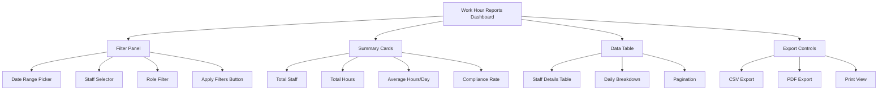
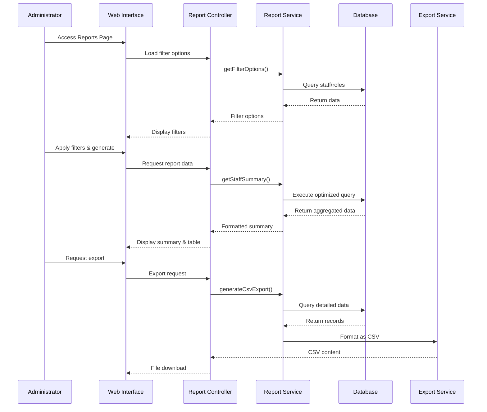

# Staff Work Hour Reports - Comprehensive Design Document

## Overview
A comprehensive staff work hour reporting system for administrators with detailed filtering, aggregation, and export capabilities integrated with the existing business hours-based attendance model.

## System Analysis

### Existing Architecture
- **Attendance Model**: Comprehensive with business hours integration, overtime calculations, breaks, and audit logging
- **Business Hours Service**: Configurable business hours with grace periods, overtime thresholds, and expected hours calculations
- **User Model**: Role-based permissions using Spatie, staff identification via roles
- **Current Reports**: Basic attendance reporting exists but lacks comprehensive work hour analytics

### Key Requirements Addressed
1. View individual staff members' detailed work hours with daily totals
2. Summary view aggregating total hours worked per staff member
3. Filter by staff member, department (role), or specific role
4. Export to CSV/PDF formats
5. Integrate with business hours-based attendance model

## Report Structure Design

### Data Points to Include
1. **Basic Information**
   - Staff Name, ID, Role(s)
   - Date range covered

2. **Daily Attendance Details**
   - Date, Day of Week
   - Check-in Time, Check-out Time
   - Hours Worked (actual)
   - Expected Hours (based on business hours)
   - Overtime Hours (calculated)
   - Break Duration
   - Net Working Hours (hours worked - breaks)
   - Status (Present, Late, Absent, Leave, Half Day)
   - Late Arrival Minutes
   - Early Departure Minutes
   - Attendance Type (Regular, Overtime, Holiday, Weekend)

3. **Aggregated Metrics**
   - Total Days Worked
   - Total Hours Worked
   - Total Expected Hours
   - Total Overtime Hours
   - Average Hours per Day
   - Attendance Rate (%)
   - Late Frequency
   - Compliance Rate (hours worked vs expected)

### Calculation Formulas
```php
// Net Working Hours = Hours Worked - (Total Break Minutes / 60)
// Overtime Hours = Overtime Minutes / 60
// Compliance Rate = (Hours Worked / Expected Hours) * 100
// Attendance Rate = (Present Days / Total Business Days) * 100
```

## Database Query Design

### Optimized Queries for Performance

#### 1. Staff Work Hour Summary Query
```sql
SELECT 
    u.id as staff_id,
    u.name as staff_name,
    u.email,
    COUNT(a.id) as total_days,
    SUM(a.hours_worked) as total_hours,
    SUM(a.expected_hours) as total_expected_hours,
    SUM(a.overtime_hours) as total_overtime,
    AVG(a.hours_worked) as avg_hours_per_day,
    COUNT(CASE WHEN a.status IN ('present', 'late') THEN 1 END) as present_days,
    COUNT(CASE WHEN a.status = 'late' THEN 1 END) as late_days,
    COUNT(CASE WHEN a.status = 'absent' THEN 1 END) as absent_days
FROM users u
LEFT JOIN attendances a ON u.id = a.user_id 
    AND a.date BETWEEN ? AND ?
    AND a.calculated_using_business_hours = true
WHERE u.id IN (
    SELECT model_id FROM model_has_roles 
    JOIN roles ON model_has_roles.role_id = roles.id 
    WHERE roles.name = 'staff'
)
GROUP BY u.id, u.name, u.email
ORDER BY u.name;
```

#### 2. Detailed Daily Report with Pagination
```sql
SELECT 
    a.date,
    a.check_in,
    a.check_out,
    a.hours_worked,
    a.expected_hours,
    a.overtime_hours,
    a.total_break_minutes,
    a.status,
    a.late_arrival_minutes,
    a.early_departure_minutes,
    a.attendance_type,
    u.name as staff_name,
    u.email
FROM attendances a
JOIN users u ON a.user_id = u.id
WHERE a.date BETWEEN ? AND ?
    AND u.id IN (SELECT model_id FROM model_has_roles WHERE role_id = ?)
    AND a.calculated_using_business_hours = true
ORDER BY a.date DESC, u.name
LIMIT ? OFFSET ?;
```

#### 3. Performance Optimizations
- **Indexes Required**:
  - `attendances(date, user_id, calculated_using_business_hours)`
  - `attendances(user_id, date)`
  - `model_has_roles(role_id, model_id)`
- **Query Caching**: Cache aggregated results for common date ranges (today, this week, this month)
- **Batch Processing**: For large date ranges, process in chunks

## API/Controller Design

### New Controller: `WorkHourReportController`

#### Endpoints:

1. **GET `/admin/reports/work-hours`** - Main report interface
   - Parameters: `start_date`, `end_date`, `staff_id`, `role_id`, `export_format`
   - Returns: HTML view or export file

2. **GET `/api/reports/work-hours/summary`** - JSON summary data
   - Parameters: `start_date`, `end_date`, `role_id`
   - Returns: Aggregated summary for all staff

3. **GET `/api/reports/work-hours/detail`** - JSON detailed data
   - Parameters: `start_date`, `end_date`, `staff_id`, `page`, `per_page`
   - Returns: Paginated detailed attendance records

4. **POST `/api/reports/work-hours/export`** - Generate export
   - Parameters: `start_date`, `end_date`, `staff_id`, `role_id`, `format` (csv/pdf)
   - Returns: Export file download

5. **GET `/api/reports/work-hours/staff-list`** - Staff filter options
   - Returns: List of staff members with roles for filtering

### Service Layer: `WorkHourReportService`

```php
class WorkHourReportService
{
    public function getStaffSummary(DateRange $range, ?int $roleId = null): Collection;
    public function getDetailedReport(DateRange $range, FilterCriteria $filters): LengthAwarePaginator;
    public function generateCsvExport(DateRange $range, FilterCriteria $filters): string;
    public function generatePdfExport(DateRange $range, FilterCriteria $filters): Response;
    public function getFilterOptions(): array;
}
```

## UI/UX Design

### Page Layout Components



### Filter Panel Design
1. **Date Range Picker**: Predefined ranges (Today, This Week, This Month, Last Month, Custom)
2. **Staff Selector**: Multi-select dropdown with search
3. **Role Filter**: Checkbox list of available roles
4. **Status Filter**: Present, Late, Absent, Leave, All

### Data Visualization
1. **Summary Cards**: Key metrics at a glance
2. **Data Table with**:
   - Sortable columns
   - Expandable rows for daily details
   - Status badges with colors
   - Hover tooltips for calculations
3. **Charts** (Future Enhancement):
   - Hours worked trend line
   - Attendance distribution pie chart
   - Overtime heatmap by day

### Responsive Design
- Mobile-friendly table with horizontal scroll
- Collapsible filter panel on small screens
- Printable optimized layout

## Export Functionality

### CSV Export Format
```csv
Staff Name,Email,Role,Date,Check-in,Check-out,Hours Worked,Expected Hours,Overtime Hours,Break Minutes,Net Hours,Status,Late Minutes,Early Departure,Attendance Type
"John Doe",john@example.com,"Staff","2025-12-01","09:15","17:30",8.25,8.00,0.25,60,7.25,"Present",15,0,"Regular"
```

### PDF Export Features
1. **Header**: Company logo, report title, date range
2. **Summary Section**: Aggregated metrics
3. **Detailed Table**: All filtered records
4. **Footer**: Generated timestamp, page numbers
5. **Styles**: Professional business report formatting

### Export Implementation
```php
class ExportService
{
    public function exportToCsv(Collection $data, array $columns): StreamedResponse;
    public function exportToPdf(Collection $data, array $summary, string $title): Response;
    
    private function generateCsvContent(Collection $data): string;
    private function generatePdfView(Collection $data): View;
}
```

## Security Design

### Access Control
1. **Role-Based Permissions**:
   - `view work hour reports`: Required for all report access
   - `export work hour reports`: Required for export functionality
   - `manage attendances`: Required for detailed staff data

2. **Data Privacy**:
   - Staff personal information only visible to authorized administrators
   - Export files protected with authentication
   - Audit logging of report access

3. **Input Validation**:
   - Date range limits (max 1 year for performance)
   - SQL injection prevention via Eloquent
   - XSS protection in exported files

### Audit Trail
- Log all report generation with parameters
- Track export downloads
- Monitor access patterns

## Implementation Plan

### Phase 1: Core Report Infrastructure
1. Create `WorkHourReportService` with aggregation logic
2. Implement optimized database queries
3. Add required indexes to database

### Phase 2: API Endpoints
1. Create `WorkHourReportController`
2. Implement JSON endpoints for frontend
3. Add request validation and error handling

### Phase 3: UI Implementation
1. Create Blade view with filter components
2. Implement DataTables integration
3. Add summary cards and metrics display

### Phase 4: Export Functionality
1. Implement CSV export with streaming
2. Add PDF export using DomPDF
3. Create export templates and styling

### Phase 5: Testing & Optimization
1. Performance testing with large datasets
2. Security review and penetration testing
3. User acceptance testing

## Database Schema Additions

### New Table: `report_cache` (Optional for performance)
```sql
CREATE TABLE report_cache (
    id BIGINT PRIMARY KEY AUTO_INCREMENT,
    cache_key VARCHAR(255) UNIQUE NOT NULL,
    data JSON NOT NULL,
    expires_at TIMESTAMP NOT NULL,
    created_at TIMESTAMP DEFAULT CURRENT_TIMESTAMP,
    INDEX idx_cache_key (cache_key),
    INDEX idx_expires_at (expires_at)
);
```

### Required Indexes on Existing Tables
```sql
-- Add to attendances table
CREATE INDEX idx_attendance_date_user_business ON attendances(date, user_id, calculated_using_business_hours);
CREATE INDEX idx_attendance_user_date ON attendances(user_id, date);

-- Add to model_has_roles table  
CREATE INDEX idx_model_role ON model_has_roles(role_id, model_id);
```

## Data Flow Diagram



## Performance Considerations

### Query Optimization Strategies
1. **Selective Indexing**: Focus on most common filter combinations
2. **Query Caching**: Cache aggregated results for 5 minutes
3. **Pagination**: Always paginate detailed results
4. **Lazy Loading**: Load detailed records on demand only

### Scalability Assumptions
- Designed for 50-100 staff members
- Date ranges up to 1 year
- Concurrent users: 5-10 administrators
- Response time target: < 2 seconds for common queries

### Monitoring Metrics
- Query execution time
- Memory usage during exports
- Concurrent report generations
- Cache hit rates

## Success Criteria
1. Administrators can generate comprehensive work hour reports within 3 clicks
2. Export functionality produces accurate, formatted files
3. System handles date ranges up to 1 year with < 3 second response time
4. All security requirements met with proper access controls
5. UI is intuitive and requires minimal training

## Next Steps
1. Review and approve this design document
2. Begin implementation in Code mode
3. Create database migrations for required indexes
4. Implement service layer with test coverage
5. Build UI components incrementally
6. Conduct thorough testing before deployment